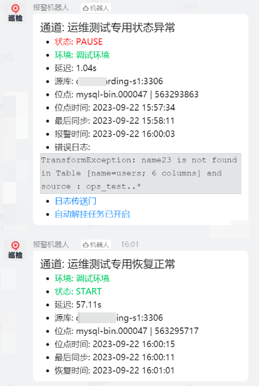
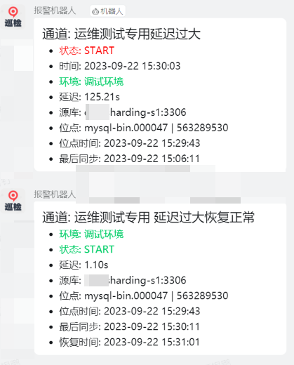

### otter同步异常钉钉报警工具

这是一个简单的otter同步钉钉报警工具
- 发送异常信息到钉钉群机器人
- 延迟过大报警以及恢复正常通知
- 异常挂起抓取日志信息以及自动解挂
- binlog位置点显示
- 源库信息显示
- 同步与恢复时间显示

#### 使用如下:
```shell
/usr/local/otter-alert/otter-dingtalk  --zk 192.168.100.xxx:2181 \
                  --mysql_host 192.168.100.xxxxx:3306 \
                  --mysql_pass 'xxxxxxxxxxxx' \
                  --mysql_db 'otter' \
                  --token xxxxxxxxxxxxxxxx  \
                  --secret xxxxxxxxxxxxxx \
                  --refresh 5m \
                  --env 开发环境 \
                  --otter-url http://192.168.100.xxx:8080 \
                  --otter-username admin \
                  --otter-password xxxxx \
                  -c 29 -c 30 -c 31 -c 33 -c 35 -c 36 -c 38
```
- -c参数为指定监控的channelID ,可以为all，也可以分开指定要监控的channelID

### 异常挂起报警以及自动解挂恢复


### 延迟过大报警以及自动恢复

